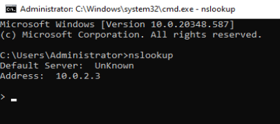
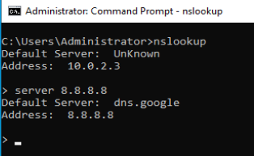

# Fer consultes a un **Servidor DNS**

A continuació s'estudia una eina per poder conèixer com obtenir la resposta a **consultes DNS** que volem fer.

El propi sistema ja s’encarrega de fer les consultes automàticament al **DNS** quan ho necessita, però també és una eina que es pot utilitzar manualment, per extreure informació molt valuosa d’un domini. Motiu pel que hem d’assegurar una bona higiene del mateix.

L’eina, d’ús més habitual, per fer les consultes a un **servei de DNS** és el **```nslookup```**. És una eina de la consola de sistema, per executar-la, cal anar a la consola i escriure:

```nslookup```


I des de la línia de comandes executem la comanda **```nslookup```**, i ens obrirà l'entorn d'**```nslookup```** per poder realitzar les consultes que vulguem.



Com veiem en el nostre cas, la primera informació que ens apareix és:

```
Default server: UnKnown
Address: 10.0.2.3
```

Això ens indica que en el moment d'iniciar l'aplicació **```nslookup```**, la nostra màquina no té definit cap **servidor de DNS**.

Per indicar a quin **servidor de DNS** volem fer les consultes, li indiquem de la següent manera:

```
> server 8.8.8.8
Default server: dns.google
Address: 8.8.8.8
```

Ara si, l'aplicació **```nslookup```** ens indica que ha trobar el **servidor de DNS** amb **adreça ip** **```8.8.8.8```**.
I també ens informa de que ha detectat que es tracta del **servidor de DNS** que respon al nom **```dns.google```**.



Per tant, a partir d'ara les respostes que rebrem a les consultes que fem, seran les respostes que ens retorni  **servidor de DNS** **```dns.google```**.

Comencem per la primera consulta.

**1.** Consulta **```ginebro.cat```**

Volem coneixer quina és la resposta que ens retorna el servidor **```dns.google (8.8.8.8)```** a la pregunta sobre el servidor **```ginebro.cat```**.

```
> ginebro.cat
Server: dns.google
Address: 8.8.8.8

Non-authoritative answer:
Name:    ginebro.cat
Address: 217.149.11.212
```

Veiem que la resposta a la pregunta de quina adreça ip respon al nom **```ginebro.cat```** és **```217.149.11.212```**

No ens ho ha dit, pero aquesta consulta ha estat de **tipus ```A```**. Per defecte, si no es diu el contrari, les ***consultes DNS*** sempre son a registres de **tipus ```A```**


Important el tipus de resposta que retorna el servidor: ***Non-authoritative answer*** (**Resposta no autoritzada**), si fos autoritzada es podria arribar a "***robar***" totes les adreces que conté el **DNS**, per després utilitzar-ho amb finalitats diguem ***no massa clares***.

**2.** Consulta de **tipus ```soa```** a **```ginebro.cat```**

Per consultar al **servidor DNS**, la informació general del domini com pot ser el servidor DNS que el manté, adreça de contacte, etc. Cal canviar el tipus de consulta:

> Per modificar el tipus de registre que volem realitzar cal fer servir a comanda **```type=```** i el tipus de **registre DNS**.

```
> set type=soa
>
```

Recordem que **```soa```** és el **node superior** d’una zona (**```SOA```**, ***```S```***```tart``` ***```O```***```f``` ***```A```***```uthority```).

```
> ginebro.cat
Server: dns.google
Address: 8.8.8.8

Non-authoritative answer:

ginebro.cat
        primary name server: ns1.filnet.es
        responsible mail addr = mariaexposito.ginebro.cat
        serial  = 2023102906
        refresh = 10800 (3 hours)
        retry   = 3600 (1 hour)
        expire  = 1209600 (14 days)
        default TTL = 10800 (3 hours)
>
```

**3.** Consulta de **tipus ```mx```** a **```ginebro.cat```**

Per esbrinar quin és el servidor de correu electrònic d’un domini:

> Per modificar el tipus de registre que volem realitzar cal fer servir a comanda **```type=```** i el tipus de **registre DNS**.

```
> set type=mx
>
```

I sembla que no ha passat res. Però ara si fem la consulta ens tornarà la resposta al registre de **tipus ```mx```** del nom **```ginebro.cat```**


```
> ginebro.cat

Server: dns.google
Address: 8.8.8.8

Non-authoritative answer:
ginebro.cat	    MX preference = 30 aspmx3.googlemail.com
ginebro.cat	    MX preference = 30 aspmx5.googlemail.com
ginebro.cat	    MX preference = 10 aspmx.l.google.com
ginebro.cat	    MX preference = 30 aspmx2.googlemail.com
ginebro.cat	    MX preference = 20 alt2.aspmx.l.google.com
ginebro.cat	    MX preference = 20 alt1.aspmx.l.google.com
ginebro.cat	    MX preference = 30 aspmx4.googlemail.com
```

El resultat que retorna va relacionat per la **preferència ```MX```** i el servidor on enviar el correu.

> La **preferència ```MX```** indica a quin servidor s’ha de preguntar primer, en cas que no respongui, el segon, tercer etc. Com més petit és el número, més preferència té **```10```**, **```20```**, **```30```**, ...

**4.** Consulta de **tipus ```CNAME```** a **```mail.ginebro.cat```**

Per comprovar on apunta un sobrenom (**```CNAME```**):

```
> set type=cname
>
```

```
> mail.ginebro.cat

Server: dns.google
Address: 8.8.8.8

Non-authoritative answer:
mail.ginebro.cat 	    canonical name = ghs.google.com
```

**5.** Consulta de **tipus ```PTR```**

I en el cas que tinguem una **adreça IP** (**```PTR```**) i es vol saber a qui correspon?


```
> set type=ptr
>
```

```
> 217.149.11.212

Server: dns.google
Address: 8.8.8.8

Non-authoritative answer:
212.11.149.217.in-addr.arpa    name = srv11212.servatica.com
```

Per què ens pot ajudar aquesta eina?

* Comprovar que es resolt correctament un nom d’equip quan s’intenta accedir des d’un navegador i indica que no la troba o no existeix.
* Comprovar quins són els servidors de correu electrònic d’un domini, per després fer proves de connectivitat sobre els mateixos.
* Com es resol l’adreça IP i a quin domini pertany, per les comprovacions de reverse lookup de correu electrònic.
* Saber on està allotjat un domini concret.
* etc.

**6.** Consulta de **registres ```DNS```** a [**who.is**](who.is)

Una altra manera de veure aquesta informació és amb pàgines web com [who.is](https://who.is), que retorna la informació de **TOTS** els **registres DNS** que hi ha a **Internet**.

[https://who.is/dns/ginebro.cat](https://who.is/dns/ginebro.cat)


